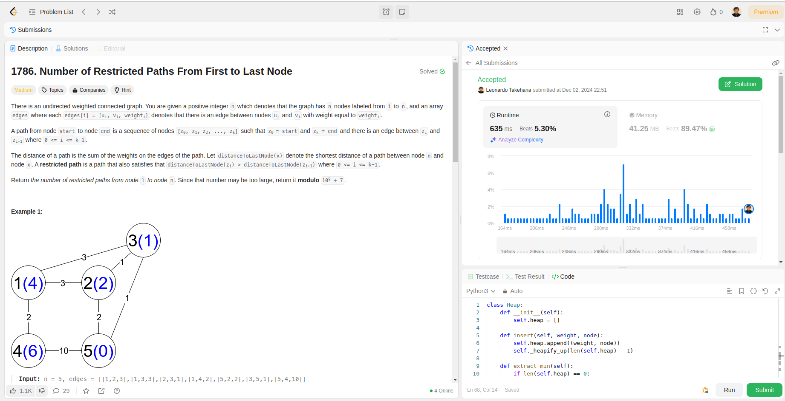
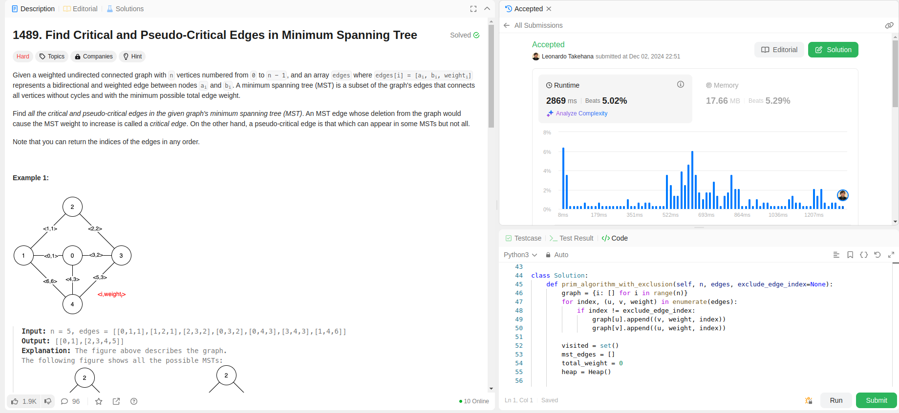
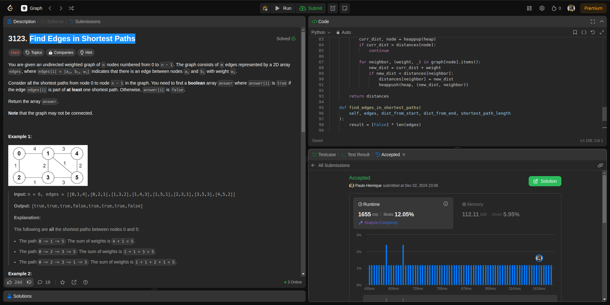

Temas:
 - Grafos2
 
# Grafos2_LeetCodeGrafos2

**Número da Lista**: 9<br>
**Conteúdo da Disciplina**: Grafos 2<br>

## Alunos
|Matrícula | Aluno |
| -- | -- |
| 19/0094257  |  Paulo Henrique de O. Rezende |
| 23/2022952  |  Leonardo de Souza Takehana |

## Sobre 
O projeto é contemplado por resolver 3 questões da plataforma LeetCode, sendo 2 dífíceis e 1 médio. A definição de médio, fácil e difícil é concebida pela própria plataforma.

Para os exercícios serem realizados, usamos o algorito de Dijkstra com heap e o algoritmo de Prim com pequenas modificações, além da implementação do algoritmo de SCC para que pudessem receber o Accept como solução para o desafio.

## Screenshots
Questão: [Médio - 1786. Number of Restricted Paths From First to Last Node](https://leetcode.com/problems/number-of-restricted-paths-from-first-to-last-node/submissions/1468806097/)


Questão: [Difícil - 1489. Find Critical and Pseudo-Critical Edges in Minimum Spanning Tree](https://leetcode.com/problems/find-critical-and-pseudo-critical-edges-in-minimum-spanning-tree/submissions/1468806169/?envType=problem-list-v2&envId=strongly-connected-component)


Questão: [Difícil - 3123. Find Edges in Shortest Paths](https://leetcode.com/problems/find-edges-in-shortest-paths/submissions/1468809861/?envType=problem-list-v2&envId=graph)



## Instalação 
**Linguagem**: python<br>
**Framework**: Não será preciso<br>
Instalar uma versão lastest stable do python desde de que seja > 3.11.  

## Uso 
Para rodar este projeto, basta entrar na raiz do projeto e executar o arquivo referente a questão que se deseja avaliar, por exemplo:
```
python3 1489.FindCriticalAndPseudo-CriticalEdgesInMinimumSpanningTree.py
```

## Outros
Desconsiderar a função </br>main()<br> dos arquivos .py ao tentar submeter ao leetcode. Esta função foi implementada apenas com o intuito de testar casos base.
